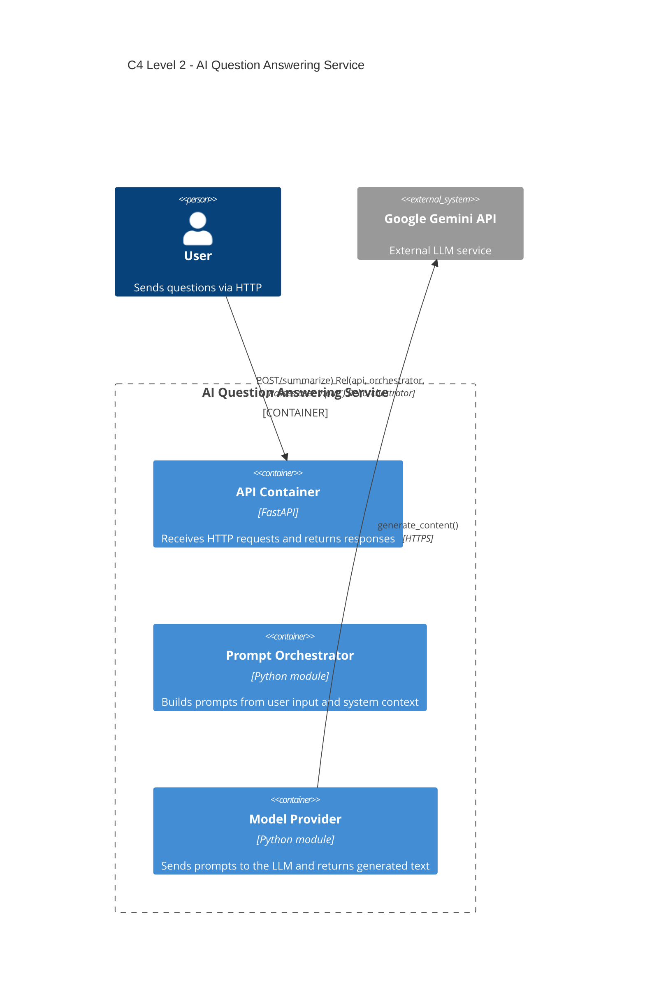

# AI Question Answering Service

## Architecture

## Container-to-Code Mapping

| Diagram Container | Code File | Responsibility |
|---|---|---|
| API Container | `main.py` | Receives HTTP requests, returns responses |
| Prompt Orchestrator | `orchestrator.py` | Builds prompts from user input and system context |
| Model Provider | `model_provider.py` | Sends prompts to Gemini, returns generated text |

## Endpoints

| Method | Path | Description |
|---|---|---|
| GET | `/health` | Health check |
| POST | `/ask` | Submit a question, receive an AI-generated answer |
| POST | `/summarize` | Submit text, receive a concise summary |